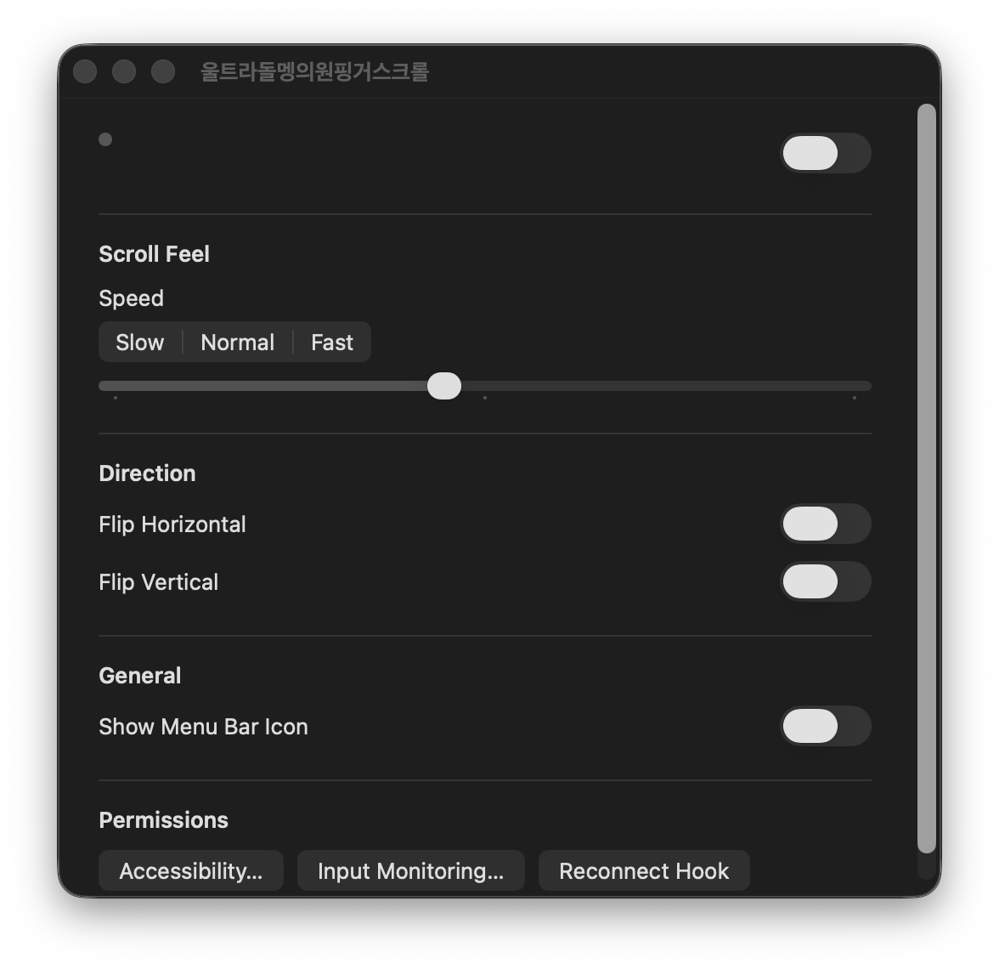

# ScrollDolmeng



트랙패드 한 손가락 움직임과 modifier key를 조합해 synthetic scroll event를 만드는 macOS 로컬 유틸리티 실험입니다. 배포 앱 표시 이름은 `울트라돌멩의원핑거스크롤`입니다.

## 만든 이유

트랙패드 스크롤은 기본 동작이 편하지만, 특정 작업에서는 더 직접적이고 세밀하게 조절되는 스크롤 방식이 필요할 때가 있습니다. ScrollDolmeng은 modifier key를 누른 상태에서 한 손가락 움직임을 스크롤로 바꾸면 더 빠르고 원하는 방식의 조작이 가능한지 실험하기 위해 만들었습니다.

## 해결 방식

macOS의 MultitouchSupport 입력을 읽고, 사용자가 정한 trigger key가 눌려 있을 때 최근 한 손가락 이동량을 synthetic scroll event로 변환합니다. 설정 화면에서 속도, 방향 반전, 메뉴바 표시, 권한 연결을 조절할 수 있습니다.

## 구현한 것

- 트랙패드 한 손가락 이동 감지
- modifier key 기반 scroll trigger
- synthetic scroll event 생성
- 스크롤 속도 조절
- 가로/세로 방향 반전
- 메뉴바 표시 여부 설정
- Accessibility / Input Monitoring 권한 안내
- 설정 마이그레이션과 스크롤 동작 테스트
- MX Master 3S Bluetooth thumb wheel 방향을 `STANDARD`로 고정

## 기술 구성

- Swift Package Manager
- AppKit
- CoreGraphics event tap
- macOS private `MultitouchSupport` framework bridge
- Swift Testing

## 실행 방법

빌드:

```bash
swift build
```

테스트:

```bash
swift test
```

`/Applications`에 앱 번들 생성:

```bash
./scripts/build_app.sh
```

빌드 후 기존 프로세스를 교체해 실행:

```bash
./script/build_and_run.sh
```

## 권한과 현재 범위

이 앱은 입력 장치와 synthetic event를 다루기 때문에 macOS Accessibility/Input Monitoring 권한이 필요합니다.

MX Master 3S 방향 고정은 Logitech Bluetooth 장치(`046d:b034`)의 물리 `AC Pan` 신호와 Logi Options+가 만든 스크롤 이벤트가 짧은 시간 안에 일치할 때만 적용됩니다. Apple 트랙패드, MX의 메인 세로 휠, 앱이 만드는 원핑거 스크롤에는 적용되지 않습니다.

또한 private `MultitouchSupport` framework를 사용하므로 App Store 배포용 제품이 아니라 로컬 macOS 유틸리티 프로토타입입니다. 목적은 트랙패드 조작감을 실험하고, 설정 가능한 작은 입력 도구를 직접 구현해보는 것입니다.
